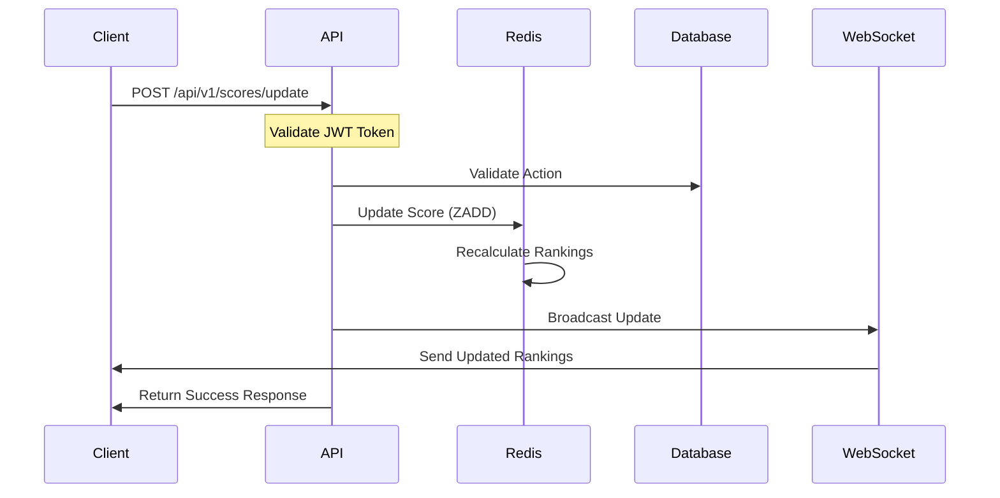

# Live Scoreboard Module Specification

## Overview

This module handles real-time score updates and maintains a live scoreboard showing the top 10 users. It ensures secure score updates while providing real-time updates to all connected clients.

## System Components

1. **Score Update API**

   - Handles authenticated score update requests
   - Validates user actions and score increments
   - Updates the persistent storage
   - Triggers real-time updates

2. **WebSocket Service**

   - Maintains live connections with clients
   - Broadcasts scoreboard updates to all connected clients
   - Handles connection management and error scenarios

3. **Score Storage**
   - Maintains user scores in a Redis sorted set
   - Provides fast access to top N users
   - Ensures atomic score updates

## API Endpoints

### POST /api/v1/scores/update

Updates a user's score based on completed actions.

Request:

```json
{
  "userId": "string",
  "actionId": "string",
  "timestamp": "ISO8601 timestamp"
}
```

Response:

```json
{
"success": true,
"newScore": number,
"rank": number
}
```

### WebSocket /ws/scoreboard

Endpoint for real-time scoreboard updates.

Messages from server:

```json
{
    "type": "SCOREBOARD_UPDATE",
    "data": {
        "rankings": [
            {
                "userId": "string",
                "username": "string",
                "score": number,
                "rank": number
            }
        ]
    }
}
```

## Security Measures

1. **Authentication**

   - All HTTP requests must include a valid JWT token
   - WebSocket connections require initial authentication
   - Rate limiting per user/IP

2. **Action Validation**
   - Each score update must reference a valid actionId
   - Actions are validated against a whitelist of allowed actions
   - Duplicate action submissions are prevented
   - Timestamps are validated to prevent replay attacks

## Data Model

```sql
-- Action Log Table
CREATE TABLE action_logs (
    id UUID PRIMARY KEY,
    user_id UUID NOT NULL,
    action_id VARCHAR(50) NOT NULL,
    timestamp TIMESTAMP NOT NULL,
    score_increment INTEGER NOT NULL,
    UNIQUE(user_id, action_id)
);

-- Redis Schema
ZADD scoreboard_rankings <score> <user_id>
```

## Flow Diagram



## Implementation Notes

1. **Performance Considerations**

   - Use Redis ZADD for O(log(N)) score updates
   - Implement caching for frequently accessed rankings
   - Consider batch updates for high-frequency events

2. **Scalability**

   - WebSocket connections should be distributed across multiple nodes
   - Use Redis pub/sub for cross-node communication
   - Implement horizontal scaling for API servers

3. **Error Handling**

   - Implement retry mechanism for failed updates
   - Handle WebSocket disconnections gracefully
   - Log all validation failures for monitoring

4. **Monitoring**
   - Track API response times
   - Monitor WebSocket connection count
   - Alert on unusual score update patterns
   - Track Redis memory usage

## Additional Recommendations

1. **Anti-Cheat Measures**

   - Implement server-side action verification
   - Add anomaly detection for suspicious patterns
   - Store client metadata (IP, device info) for audit

2. **Testing Requirements**

   - Unit tests for score calculation logic
   - Load tests for WebSocket connections
   - Integration tests for real-time updates
   - Security penetration testing

3. **Future Improvements**
   - Add support for different scoring periods (daily, weekly, monthly)
   - Implement leaderboard categories
   - Add achievement system
   - Support for team rankings

```

This specification provides a comprehensive guide for implementing the live scoreboard system. The key aspects addressed are:

1. **Security**: JWT authentication, action validation, and rate limiting protect against unauthorized score updates.

2. **Real-time Updates**: WebSocket implementation ensures immediate scoreboard updates for all connected clients.

3. **Performance**: Using Redis sorted sets provides efficient score updates and ranking calculations.

4. **Scalability**: The system is designed to handle multiple nodes and high concurrent users.

5. **Monitoring**: Comprehensive logging and monitoring ensure system health and detect potential issues.

The engineering team should pay special attention to:
- Implementing proper error handling
- Setting up monitoring and alerting
- Following security best practices
- Testing under high load conditions
- Implementing the anti-cheat measures

Would you like me to elaborate on any specific aspect of the specification?
```
